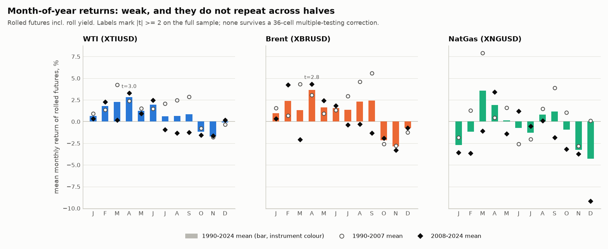
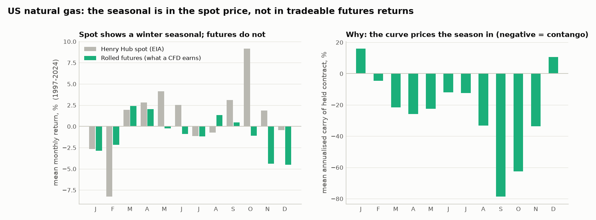
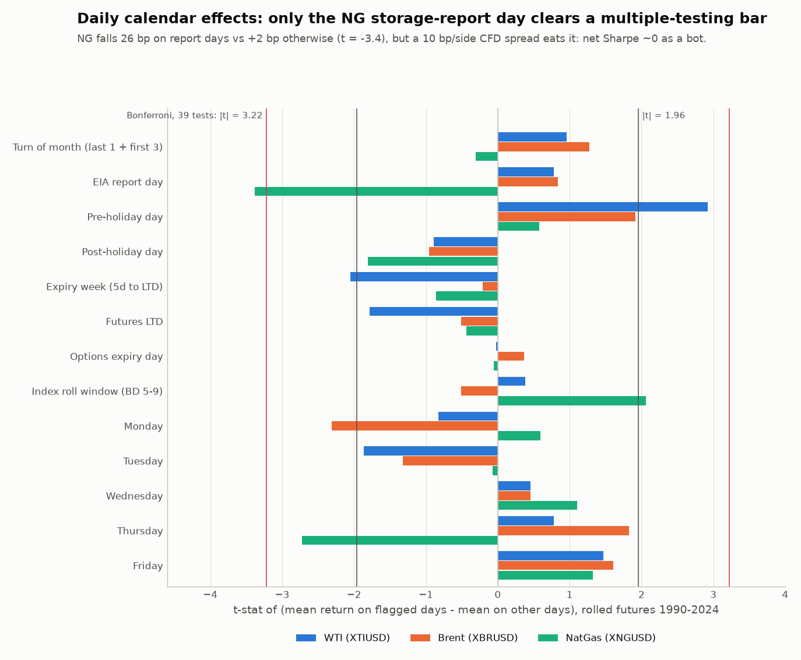
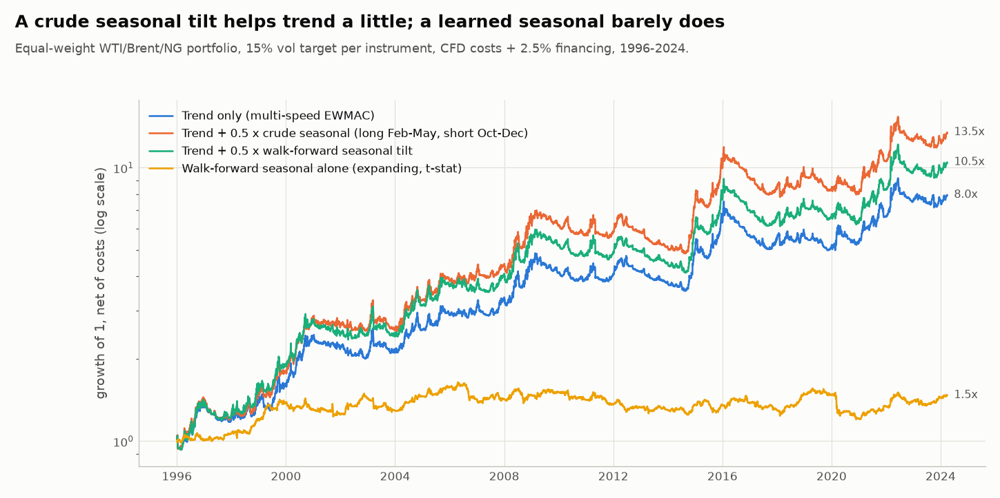

# E04: Seasonality and calendar effects (XTIUSD, XBRUSD, XNGUSD)

Script: `experiments/e04_seasonality.py`. It regenerates every CSV and PNG below in about 50 seconds.
Calendar helpers: `src/calendar_tools.py`. Chart style: `src/plotstyle.py`.

**Bottom line.** There is no calendar bot here worth running on its own after realistic CFD costs and an honest count of the variants tried. One idea is worth keeping as a small add-on to trend following: a crude "driving-season" tilt (long WTI/Brent Feb-May, optionally short Oct-Dec). It is marginal. Two daily effects look statistically real but are too small or too expensive to trade:
- US natural gas falls on storage-report days.
- Crude rises on the day before a US holiday.

Every natural-gas seasonal idea fails on futures. The gas seasonal exists in the Henry Hub spot price, but the steep contango charges you for it.

## Setup (applies to every number below)
- **P&L series.** Rolled futures `ret`, which includes roll yield (WTI = Dec contract, Brent = 2nd-3rd month, NG = ~2nd month), 1990-2024-03. EIA spot is used only for comparison: it has no roll yield, so it is not tradeable.
- **Timing.** A signal formed at close t uses data up to t plus calendar facts about t+1. Holidays, report schedules and expiry rules are all published in advance. The position trades at close t and earns t+1 (`evaluate(lag=1)`).
- **Sizing and costs.** Vol-targeted to 15%/yr per instrument with a 10% buffer. CFD spreads of 3 / 3.5 / 10 bp per side, plus a 2.5%/yr financing markup. The portfolio (PORT) is an equal-weight average of the instruments.
- **Sub-periods.** IS = 1990-2007, OOS = 2008-2024.
  - Walk-forward strategies are out-of-sample throughout by construction.
  - The "fixed" month rules come from market lore that was itself formed on historical data, so their 2008+ numbers are not a clean holdout.
- **Causality check.** Every signal function was tested by randomising all data after a cutoff: signals before the cutoff did not change.

## Results table

| Strategy | Instrument | Period | Net SR | IS SR 1990-07 | OOS SR 2008-24 | Gross SR | CAGR | Max DD | Turnover/yr | Verdict |
|---|---|---|---:|---:|---:|---:|---:|---:|---:|---|
| Walk-forward seasonal, expanding window, sign | XTIUSD | 1995-2024 | 0.25 | 0.45 | 0.10 | 0.35 | 2.7% | -48.2% | 3.8 | reject |
| Walk-forward seasonal, expanding window, sign | XBRUSD | 1995-2024 | 0.37 | 0.44 | 0.31 | 0.45 | 4.6% | -45.3% | 3.0 | reject |
| Walk-forward seasonal, expanding window, sign | XNGUSD | 1995-2024 | 0.03 | -0.12 | 0.14 | 0.11 | -0.8% | -55.2% | 3.7 | reject |
| Walk-forward seasonal, expanding window, sign | PORT (3) | 1995-2024 | 0.30 | 0.37 | 0.24 | 0.42 | 2.8% | -28.7% | 3.5 | reject |
| Walk-forward seasonal, expanding window, t-stat | PORT (3) | 1995-2024 | 0.17 | 0.29 | 0.06 | 0.28 | 0.9% | -26.8% | 2.9 | reject |
| Walk-forward seasonal, 10-year window, sign | PORT (3) | 2000-2024 | -0.02 | 0.38 | -0.20 | 0.11 | -0.8% | -50.0% | 4.1 | reject |
| Walk-forward seasonal, 5-year window, sign | PORT (3) | 1995-2024 | -0.30 | 0.08 | -0.61 | -0.17 | -3.9% | -76.7% | 4.9 | reject |
| Walk-forward seasonal, 15-year window, sign | PORT (3) | 2005-2024 | -0.16 | -0.43 | -0.12 | -0.02 | -2.3% | -49.3% | 3.7 | reject |
| Crude long Feb-May (driving season) | XTIUSD | 1991-2024 | 0.44 | 0.63 | 0.26 | 0.50 | 3.6% | -32.5% | 1.8 | marginal |
| Crude long Feb-May (driving season) | XBRUSD | 1990-2024 | 0.47 | 0.61 | 0.33 | 0.52 | 3.8% | -33.8% | 1.4 | marginal |
| Crude long Feb-May (driving season) | PORT (WTI+Brent) | 1990-2024 | 0.46 | 0.63 | 0.31 | 0.53 | 3.7% | -33.0% | 1.6 | marginal |
| Crude short Oct-Dec (Q4 weakness) | PORT (WTI+Brent) | 1990-2024 | 0.25 | 0.28 | 0.22 | 0.30 | 1.6% | -26.5% | 1.5 | reject (3 crash years) |
| Crude long Feb-May + short Oct-Dec | XTIUSD | 1991-2024 | 0.45 | 0.60 | 0.30 | 0.54 | 4.6% | -36.2% | 3.2 | marginal |
| Crude long Feb-May + short Oct-Dec | XBRUSD | 1990-2024 | 0.56 | 0.69 | 0.43 | 0.63 | 6.0% | -40.0% | 2.5 | marginal |
| Crude long Feb-May + short Oct-Dec | PORT (WTI+Brent) | 1990-2024 | 0.52 | 0.65 | 0.38 | 0.60 | 5.3% | -37.9% | 2.8 | marginal |
| NG long Aug-Oct | XNGUSD | 1991-2024 | 0.03 | 0.30 | -0.28 | 0.07 | -0.1% | -53.2% | 1.0 | reject |
| NG long Sep-Nov | XNGUSD | 1991-2024 | -0.21 | -0.02 | -0.41 | -0.17 | -2.0% | -51.4% | 1.0 | reject |
| NG short Jan-Apr | XNGUSD | 1991-2024 | -0.26 | -0.61 | 0.11 | -0.21 | -2.5% | -68.8% | 1.0 | reject |
| NG long Aug-Oct + short Jan-Apr | XNGUSD | 1991-2024 | -0.17 | -0.23 | -0.10 | -0.10 | -2.5% | -70.7% | 1.9 | reject |
| Same, trades only when the carry anomaly agrees | XNGUSD | 1991-2024 | 0.05 | -0.03 | 0.11 | 0.14 | 0.0% | -33.7% | 4.7 | reject |
| NG long Sep-Nov on Henry Hub spot (not tradeable) | XNGUSD spot | 1999-2026 | 0.39 | 0.74 | 0.33 | 0.42 | 3.1% | -19.4% | 0.7 | not tradeable |
| Carry sign (side finding, not seasonality) | XTIUSD | 1991-2024 | 0.55 | 0.51 | 0.59 | 0.68 | 7.4% | -42.1% | 14.8 | separate study |
| Carry sign (side finding, not seasonality) | XBRUSD | 1990-2024 | 0.53 | 0.61 | 0.43 | 0.65 | 6.5% | -38.6% | 14.8 | separate study |
| Carry sign (side finding, not seasonality) | XNGUSD | 1991-2024 | -0.15 | -0.13 | -0.16 | -0.01 | -2.9% | -70.6% | 10.1 | reject |
| Pre-holiday long (in market ~9 days/yr) | XTIUSD | 1991-2024 | 0.44 | 0.57 | 0.33 | 0.59 | 1.1% | -8.2% | 11.3 | marginal |
| Pre-holiday long (in market ~9 days/yr) | XBRUSD | 1990-2024 | 0.30 | 0.23 | 0.35 | 0.45 | 0.7% | -11.7% | 9.3 | marginal |
| NG EIA storage day, walk-forward sign | XNGUSD | 1991-2024 | 0.01 | -0.21 | 0.22 | 0.54 | -0.2% | -29.7% | 35.4 | reject |
| Turn of month, long | PORT (3) | 1990-2024 | 0.01 | 0.31 | -0.28 | 0.17 | -0.1% | -42.1% | 12.7 | reject |
| Day of week, walk-forward sign | PORT (3) | 1990-2024 | -0.54 | -0.47 | -0.61 | 0.18 | -5.7% | -86.6% | 112.5 | reject |
| Expiry week, short | PORT (3) | 1990-2024 | -0.18 | -0.37 | 0.05 | 0.02 | -0.9% | -33.5% | 12.7 | reject |
| **Trend only (reference)** | PORT (3) | 1990-2024 | **0.55** | 0.63 | 0.46 | 0.65 | 7.0% | -33.7% | 5.9 | reference |
| **Trend + 0.5 x crude seasonal (Feb-May / Oct-Dec)** | PORT (3) | 1990-2024 | **0.65** | 0.76 | 0.54 | 0.76 | 9.1% | -34.4% | 6.4 | marginal (best add-on) |
| Trend + 0.5 x walk-forward seasonal tilt | PORT (3) | 1990-2024 | 0.57 | 0.66 | 0.48 | 0.68 | 7.7% | -33.0% | 6.6 | reject |
| Trend + 0.5 x pre-holiday tilt (crude) | PORT (3) | 1990-2024 | 0.57 | 0.65 | 0.48 | 0.68 | 7.3% | -32.2% | 7.9 | marginal |
| Trend + 0.5 x NG EIA-day tilt | PORT (3) | 1990-2024 | 0.56 | 0.62 | 0.50 | 0.69 | 7.2% | -34.7% | 9.1 | reject |

**Notes on the table**
- **SR** is the annualised Sharpe ratio. "Gross" means before spreads and the financing markup. PORT (3) is the equal-weight WTI/Brent/NG portfolio.
- **Turnover** is traded notional per year in multiples of equity. For PORT rows it is the per-instrument average.
- **Calendar-based rules are not stress-tested with a one-day lag.** A lag of 2 moves a one-day calendar effect onto the wrong day (for example, pre-holiday onto post-holiday), so it tests nothing useful. They are stress-tested with 2x costs instead.
- **The monthly crude rules are also robust to lag = 2.** Feb-May gives 0.46, and the combined rule gives 0.49 (see `e04_robustness.csv`).

## 1. Month-of-year returns

**No month effect is statistically significant on the futures.**
- The joint equality-of-means test is not significant for any instrument:

  | | WTI | Brent | NG |
  |---|---:|---:|---:|
  | ANOVA p | 0.33 | 0.16 | 0.51 |
  | Kruskal-Wallis p | 0.28 | 0.20 | 0.13 |

- Only 2 of the 36 instrument x month cells have |t| > 2 (1.6 would be expected by chance): **April** for WTI (+2.8%/month, t = 3.0) and Brent (+3.6%, t = 2.8). The smallest adjusted p-values are 0.17 (Benjamini-Hochberg false-discovery-rate) and 0.20 (Holm).

**The patterns do not repeat across halves.** Correlating the 12 monthly means from 1990-2007 with those from 2008-2024 gives 0.27 (WTI), 0.17 (Brent) and 0.06 (NG). For NG, only 5 of 12 months have the same sign in both halves.

Example: NG March was +7.9% (t = 3.2) in 1990-2007 and -1.1% in 2008-2024.

**The only broad feature is in crude:** it tended to be firm from February to June and weak in October-November, in both halves. This is the classic driving-season / Q4 story (see section 4).

**Henry Hub spot is the only series with a significant seasonal** (Kruskal-Wallis p = 0.02): February -8.3%, October +9.2%. It cannot be traded (section 3).

## 2. Walk-forward seasonal strategy (no look-ahead)
**Rule.** Each month, go long or short according to the sign (or clipped t-stat) of that calendar month's mean over the previous N years.

**Rolling windows lose money**, in every version tested:

| Window | PORT net SR |
|---|---:|
| 5 years | -0.30 |
| 10 years | -0.02 |
| 15 years | -0.16 |

**Only the expanding window is positive:** 0.30 (sign version) and 0.17 (t-stat version) from 1995. On the common 2006-2024 window this falls to 0.17 and -0.01.

**What the expanding window works on is really crude, not a general seasonal.** It works only because it eventually settles on the broad crude spring-up / autumn-down shape (WTI 0.25, Brent 0.37). On NG it earns about 0.

**Verdict: reject.** Seasonal means estimated from 5-15 years are mostly noise, and the small signal that exists is captured more simply by the fixed crude rule. EIA spot gives the same picture.

## 3. Natural gas: why the classic seasonal trades do not work

**The textbook ideas all fail on futures:**

| Rule | Net SR (futures) |
|---|---:|
| Long NG Aug-Oct | 0.03 |
| Long NG Sep-Nov | -0.21 |
| Short NG Jan-Apr | -0.26 |
| Combined (long Aug-Oct, short Jan-Apr) | -0.17 |

**On spot, the autumn long appears to work.** Long Henry Hub spot Sep-Nov has a Sharpe of 0.39: spot rises into October (+9.2%) and falls in February (-8.3%).

**The contango explains the difference.** The futures curve already prices the winter premium. The held contract's annualised carry is -33% in August, -79% in September and -62% in October, which is exactly when the autumn long is held. Across all months, a regression over 1997-2024 gives:

  futures monthly return = 0.63 x spot return + 0.64 x (carry / 12)   (t = 14.5 and 3.6, R² = 0.65)

So what spot gains in the autumn, a futures-based CFD pays back through roll-down.

**Carry adds nothing once the seasonal part is removed.**
- **Regression test.** Carry at the start of the month, demeaned within each calendar month, does not predict NG futures returns (month fixed effects, t = 0.18).
- **Filtered trades.** Taking the seasonal trades only when carry is less steep (or steeper) than its 5-year norm for that month gives a net Sharpe of 0.05.
- **Carry sign alone.** Trading the plain carry sign on NG loses (-0.15). This is because NG carry is almost entirely seasonal.

**Verdict: reject** every NG seasonal and carry-conditioned variant.

## 4. Crude: driving season and Q4 weakness
**Long WTI/Brent Feb-May (driving season)** is the most defensible monthly rule:
- Portfolio (WTI+Brent) net Sharpe 0.46: 0.63 in 1990-2007 and 0.31 in 2008-2024.
- Positive in 23 of 35 years, with a median year of +5.3%.
- Still 0.32 without its three best years.
- One round trip per year per instrument (two for the long/short version), so cost-insensitive: 0.46 at 2x costs.
- Its maximum drawdown is -33%, because it holds full vol-targeted exposure while in the market.

**Short Oct-Dec (Q4 weakness) is a crash artifact.** Its Sharpe of 0.25 comes entirely from three years: 2014 (+31%), 2018 (+22%) and 1993 (+19%). Without them the Sharpe is -0.01, and the median year is 0.0%.

**Window-selection check.** Across all 24 contiguous 3- and 4-month long-only windows, Feb-Apr ranks 1st (0.53) and Feb-May ranks 2nd among 4-month windows. All windows starting September-November are negative; July-August starts are about flat. So some choice of the best window has already happened. The broad pattern (first half of the year up, second half down) is consistent, but the exact months are partly fitted.

**Verdict: marginal.**
- **In favour:** a plausible story (refinery restarts and gasoline demand), low turnover, the right sign in both halves, and robust to costs.
- **Against:** it is not significant after multiple testing (deflated Sharpe probability 0.04-0.13 against all tested variants, 0.21-0.46 within the month-of-year family). It also depends on a handful of big years.
- **Recommendation:** use it only as a small tilt on trend following (section 7), not as a standalone bot.

## 5. Daily calendar effects

39 tests: 13 effects x 3 instruments, futures, 1990-2024, on the US calendar.

**NG storage-report day (Thursday since 2002, AGA Wednesday before): the one effect that survives multiple testing.**
- NG futures return -26 bp on report days vs +1.8 bp on other days (t = -3.4, Holm-adjusted p = 0.03).
- Negative in both halves (t = -1.9 and -2.7).
- Confirmed on near-month NG futures (-34 bp, t = -2.9) and on Henry Hub spot (t = -2.3). In effect, the whole negative drift of NG futures happens on report days.
- Report-day volatility is 12% higher.
- **It is not tradeable at CFD costs.** Traded alone (walk-forward sign), the gross Sharpe of 0.54 falls to a net 0.01 at 10 bp/side, and to -0.49 at 2x costs. As a tilt on trend it adds +0.01 Sharpe.
- **Verdict: reject** as a bot. It is an interesting fact for risk management (for example, avoid adding to NG longs into Thursday).

**Pre-holiday (last trading day before a US exchange holiday): real but tiny.**
- WTI +32 bp vs +3 bp on other days (t = 2.9, Benjamini-Hochberg p = 0.07). Positive in both halves (t = 2.7 and 1.7). The 5%-trimmed mean is also 32 bp.
- Also present in near-month WTI (t = 1.9) and RBOB gasoline (t = 3.2). Absent in heating oil and gasoil; Brent t = 1.9.
- As a bot (WTI):

  | Setting | Net Sharpe | Notes |
  |---|---:|---|
  | Standard costs | 0.44 | in the market only ~9 days a year, 1.1%/yr at the 15% vol target, -8% max drawdown |
  | 2x costs | 0.31 | |

- **Verdict: marginal.** Real-looking, but with tiny capacity and fragile statistics (deflated Sharpe probability 0.04-0.19).

**Turn of month (last day + first 3 days):**
- t = 1.0 (WTI), 1.3 (Brent), -0.3 (NG).
- The long strategy's net Sharpe is 0.01: 0.31 before 2008 and -0.28 after.
- **Verdict: reject.**

**Day of week:**
- Only Brent Monday stands out (t = -2.3, joint weekday test p = 0.02). The NG Thursday effect is the storage report above.
- A walk-forward day-of-week bot trades 112x a year: gross 0.18, net -0.54.
- **Verdict: reject.**

**Expiry week, last trading day, options expiry, index-roll window (business days 5-9):**
- No |t| above 2.1, and none survives false-discovery-rate adjustment.
- Near-month WTI shows no expiry-week effect either (t = -0.8). CRUDE_W holds the Dec contract, so front-month expiry pressure would be invisible in that series anyway.
- **Verdict: reject.**

**Post-holiday days are weak on average** (NG -43 bp, t = -1.8) and about 35% more volatile. Not tradeable.

## 6. Multiple testing
- **What was tested.** 119 per-instrument standalone variants from 50 strategy definitions. The spread of their Sharpe ratios implies that the best of 119 would reach about **0.75 by luck alone**.
- **What was found.** The best observed Sharpe is 0.56 (Brent, Feb-May long / Oct-Dec short). Its deflated Sharpe probability is 0.13.
- **Within families the bar is lower, but nothing clears it convincingly:**

  | Family | Luck-only best Sharpe | Deflated Sharpe probability |
  |---|---:|---:|
  | Month-of-year (47 trials) | 0.58 | 0.21-0.46 |
  | Daily calendar (63 trials) | 0.64 | 0.13-0.19 |

- **Only one effect clears a strict correction:** the NG report-day mean, as a statistical effect rather than a strategy (Holm-adjusted p = 0.03).
- Details: `e04_multiple_testing.csv`.

## 7. Overlay: trend vs trend + seasonal tilt

**Adding 0.5 x the crude rule to multi-speed EWMAC** (long Feb-May, short Oct-Dec, crude only) lifts portfolio net Sharpe from 0.55 to 0.65:

| | Full | IS 1990-2007 | OOS 2008-2024 |
|---|---:|---:|---:|
| Trend only | 0.55 | 0.63 | 0.46 |
| Trend + 0.5 x crude tilt | 0.65 | 0.76 | 0.54 |

- Daily return difference t = 3.2, and 24 of 35 years better.
- Robust to lag = 2 (0.63) and 2x costs (0.63).
- The tilt's standalone returns correlate only 0.10 with trend, so the gain is roughly what adding an uncorrelated Sharpe-0.5 stream should give, if that stream is real.
- **The caveat is the same as in section 4:** the tilt's own edge is not statistically established.

**The other tilts add little or nothing:**

| Tilt | Change in Sharpe |
|---|---:|
| Walk-forward seasonal | +0.03 (t = 1.4) |
| Walk-forward seasonal, 10-year sign | -0.04 |
| Pre-holiday | +0.02 |
| NG storage day | +0.01 |

## Data issues found
1. **The EIA spot mirror is missing many weekdays**: 1994-2006 and 2011, up to 122 missing days in 2003. Spot returns across these gaps span several days. Day-level spot tests therefore use only single-day ("gap-free") returns, which leaves little NG spot data before 2008.
2. **pysystemtrade hourly data (2013-2020) contains rows on US holidays for WTI and NG.** These are Globex partial sessions. For calendar work they were folded into the next US trading day, preserving the compounded return (`calendar_tools.merge_holiday_rows`). ICE Brent genuinely trades on most US holidays.
3. **Small futures data gaps:** WTI and NG 2014-07-31 to 08-05, plus scattered 2014 days; NG 2018-09-07 to 09-12.
4. **CRUDE_W (XTIUSD) always holds the December contract,** 2-15 months out. It has lower volatility than the front month and no front-month expiry dynamics, so expiry effects were cross-checked on CRUDE_ICE (near-month WTI, 2006+).
5. **Henry Hub spot is a poor proxy for NG futures:** daily correlation 0.1-0.4, because the spot is day-ahead physical gas. **EIA Brent spot lags Brent futures by about a day** (asynchronous closes).
6. **The first spot run mislabelled the early period.** "1990-2007" for spot silently included 1986-89; this was fixed.

## Files
- **Month-of-year:** `e04_month_of_year.csv` (per month, period and dataset: mean, t, p, adjusted p), `e04_month_of_year_joint_tests.csv`, `e04_month_of_year.png`
- **NG spot vs futures:** `e04_ng_spot_vs_futures_by_month.csv`, `e04_ng_carry_regressions.csv`, `e04_ng_spot_vs_futures.png`
- **Walk-forward seasonal:** `e04_walkforward_seasonal.csv` (own and common windows, futures and spot)
- **Fixed month and carry rules:** `e04_fixed_rules.csv`, `e04_crude_window_selection.csv`, `e04_crude_rule_year_concentration.csv`, `e04_crude_rule_yearly_returns.csv`
- **Daily effects:** `e04_daily_effects.csv`, `e04_daily_effects_crosscheck.csv`, `e04_pre_holiday_by_holiday.csv`, `e04_daily_strategies.csv`, `e04_daily_effects.png`
- **Multiple testing and robustness:** `e04_multiple_testing.csv`, `e04_robustness.csv`, `e04_all_variants.csv`
- **Overlay:** `e04_trend_overlay.csv`, `e04_trend_overlay_diff.csv`, `e04_walkforward_vs_trend.png`
- **Headline table:** `e04_summary_table.csv`
