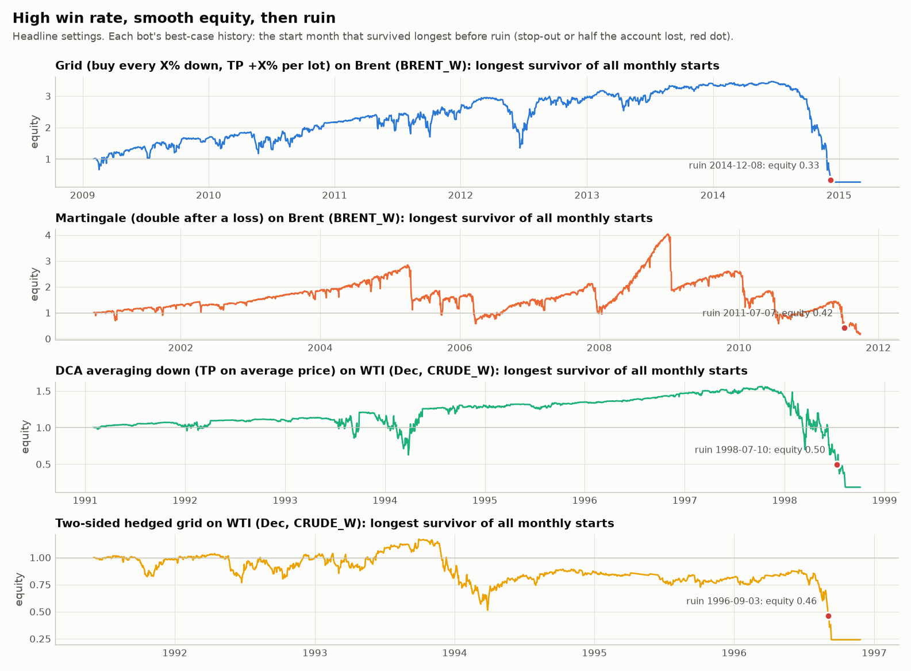
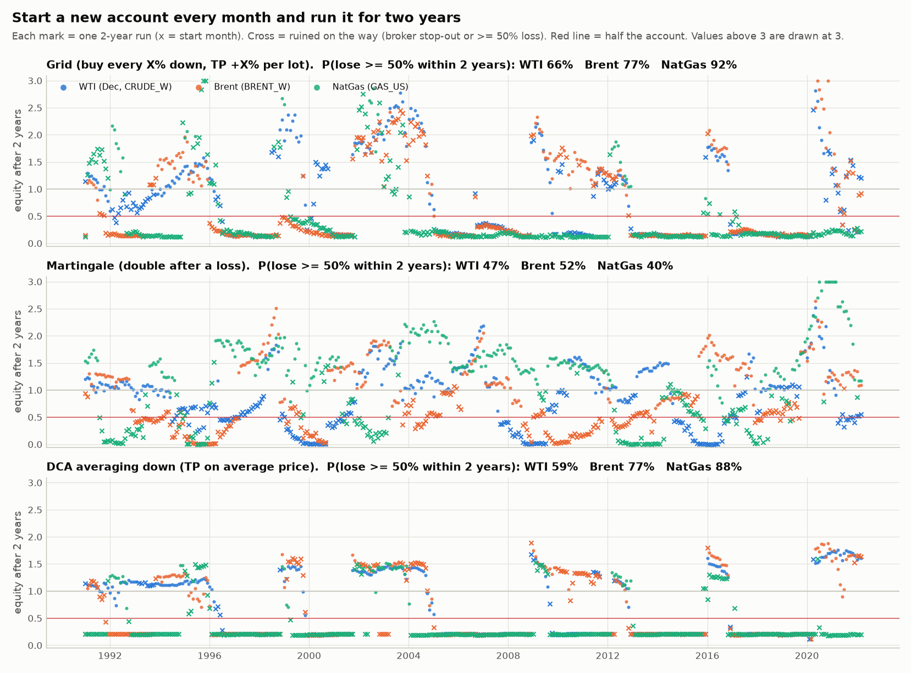
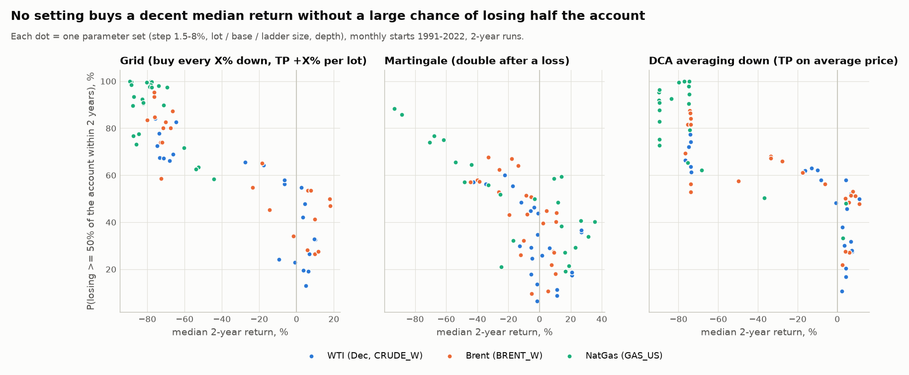
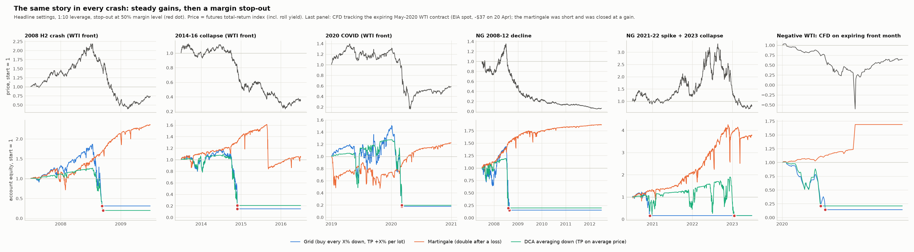

# E07: Grid, martingale and averaging-down (DCA) bots, a risk demonstration

Script: `experiments/e07_grid_martingale.py` (about 60 s). Simulator: `src/retail_bots.py` (numba).

**Verdict: reject all of them.** This covers the long-only grid, the two-sided hedged grid, the martingale and DCA averaging-down, at every one of the 72 settings per bot tested.

- **The pattern is the one retail buyers are shown: 100% of closed trades win and equity climbs smoothly, until a trend or a crash hits.** An open losing position is never closed until the broker does it.
- **Over 2-year windows (a new account every month, 1991-2022):**

  | Bot (headline settings) | P(lose at least half the account) | Median 2-year result |
  |---|---:|---:|
  | Grid | 66-92% | -38% to -83% |
  | DCA | 59-88% | about -79% |
  | Martingale | 40-52% | coin flip, 5th percentile about -99% |
  | Trend following at 15% vol (reference) | 0% | +5% to +14% (worst 2-year window -26% to -34%) |

- **"Set and forget" runs:** 91-100% of grid and DCA accounts are eventually ruined, after a median of 0.5-1.4 years.

## Account and bot model
- **Account.** Starts at 1.0 (read as 10,000 USD).
  - Leverage 1:10 (the ESMA retail limit for commodities), so margin is 10% of notional.
  - **Stop-out at a 50% margin level:** the broker closes everything, and the bot is dead.
  - Negative-balance protection floors equity at 0.
  - Costs: spread per fill of 3 / 3.5 / 10 bp per side, plus a 2.5%/yr financing markup on notional.
- **P&L series.** The futures total-return index, so the contango roll cost or backwardation gain is inside the P&L, as with a futures-referenced CFD's swap:
  - WTI = the December contract (CRUDE_W).
  - "WTI front" = near-month (CRUDE_ICE, 2006+). This is what most XTIUSD CFDs actually track.
  - Brent = BRENT_W.
  - NG = GAS_US; "NG front" = GAS-LAST, 2006+.
- **Execution.** The bot is evaluated once a day at the close.
  - Limit-type orders (grid entries, take-profits) fill at their level, never better than the close.
  - The broker monitors margin continuously: a stop-out fills where the margin level first hits 50%, or at the open after a gap (intraday mode).
- **Robustness run.** Oanda CFD high/low/open ratios (2005-2020) are used to check stop-outs and the martingale's stop-loss / take-profit against the intraday range, adverse extreme first.

**Headline settings (typical retail):**
- **Step size.** 3% for crude, 5% for gas (about 1.5 daily standard deviations).
- **(a) Grid.** Buy a lot every step down; each lot takes profit one step above its entry (step = take-profit, "symmetric"). No stop, at most 8 lots of 0.5x equity (4x when full). The two-sided hedged variant also sells every step up.
- **(b) Martingale.** One position at a time, direction = sign of 20-day momentum, take-profit = stop-loss = one step. Size doubles after each loss (up to 6 times), resets after a win, and is capped at 9x equity.
- **(c) DCA.** Base order plus 6 safety orders, one every step below the last fill, each 1.5x larger (a 5x ladder in total). Take profit at +2% on the average price; no stop.

## Results table (headline settings)
- **Sharpe, IS/OOS, gross, CAGR, max drawdown, trades/yr** come from a continuous "re-funded" track: a fresh account after every blow-up, and sizes re-based to the balance every 2 years.
- **The P(...) and 2-year columns** come from the monthly-start study.

| Strategy | Instrument | Period | Net SR | IS SR -2007 | OOS SR 2008+ | Gross SR | CAGR (re-funded) | Max DD | Trades/yr | Blow-ups/decade | P(stop-out, 2y) | P(loss >= 50%, 2y) | Median 2y return | Worst 2y | Win rate (closed) | Verdict |
|---|---|---|---:|---:|---:|---:|---:|---:|---:|---:|---:|---:|---:|---:|---:|---|
| Grid (buy every X% down, TP +X%/lot) | WTI (Dec, CRUDE_W) | 1991-2024 | -0.04 | -0.01 | -0.06 | 0.15 | -43% | -100% | 20 | 3.9 | 47% | 66% | -38% | -88% | 100% | reject |
| Grid | Brent (BRENT_W) | 1991-2024 | -0.40 | -0.29 | -0.50 | -0.24 | -65% | -100% | 25 | 6.8 | 57% | 77% | -74% | -87% | 100% | reject |
| Grid | NatGas (GAS_US) | 1991-2024 | -0.56 | -0.13 | -1.06 | -0.43 | -86% | -100% | 18 | 10.9 | 76% | 92% | -83% | -89% | 100% | reject |
| Grid | WTI front (CRUDE_ICE) | 2006-2024 | -0.36 | -0.29 | -0.36 | -0.18 | -79% | -100% | 29 | 9.8 | 75% | 86% | -81% | -87% | 100% | reject |
| Grid | NatGas front (GAS-LAST) | 2007-2024 | -0.62 | -0.09 | -0.64 | -0.53 | -90% | -100% | 17 | 12.2 | 90% | 96% | -86% | -89% | 100% | reject |
| Two-sided hedged grid | WTI (Dec, CRUDE_W) | 1991-2024 | -0.81 | -0.88 | -0.78 | -0.71 | -74% | -100% | 35 | 8.4 | 74% | 91% | -74% | -89% | 100% | reject |
| Two-sided hedged grid | Brent (BRENT_W) | 1991-2024 | -0.85 | -0.56 | -1.13 | -0.85 | -83% | -100% | 45 | 11.3 | 87% | 95% | -75% | -89% | 100% | reject |
| Two-sided hedged grid | NatGas (GAS_US) | 1991-2024 | -0.75 | -0.89 | -0.60 | -0.73 | -87% | -100% | 37 | 11.8 | 89% | 94% | -77% | -93% | 100% | reject |
| Martingale (double after a loss) | WTI (Dec, CRUDE_W) | 1991-2024 | -0.06 | 0.06 | -0.17 | 0.06 | -20% | -100% | 38 | 0.6 | 0% | 47% | -3% | -100% | 53% | reject |
| Martingale | Brent (BRENT_W) | 1991-2024 | 0.07 | 0.03 | 0.12 | 0.17 | -15% | -100% | 48 | 0.3 | 0% | 52% | -22% | -100% | 53% | reject |
| Martingale | NatGas (GAS_US) | 1991-2024 | 0.22 | 0.18 | 0.28 | 0.40 | -12% | -100% | 38 | 1.2 | 0% | 40% | +35% | -100% | 56% | reject |
| Martingale | WTI front (CRUDE_ICE) | 2006-2024 | 0.05 | -0.45 | 0.11 | 0.15 | -16% | -98% | 57 | 0.5 | 0% | 46% | -10% | -100% | 54% | reject |
| Martingale | NatGas front (GAS-LAST) | 2007-2024 | 0.08 | 0.14 | 0.08 | 0.17 | -23% | -100% | 39 | 0.6 | 0% | 48% | +22% | -100% | 54% | reject |
| DCA averaging down (TP on average) | WTI (Dec, CRUDE_W) | 1991-2024 | -0.12 | -0.04 | -0.18 | -0.12 | -40% | -100% | 19 | 3.9 | 53% | 59% | -79% | -88% | 100% | reject |
| DCA | Brent (BRENT_W) | 1991-2024 | -0.20 | -0.02 | -0.37 | -0.22 | -56% | -100% | 21 | 5.9 | 57% | 77% | -79% | -88% | 100% | reject |
| DCA | NatGas (GAS_US) | 1991-2024 | -0.35 | -0.18 | -0.51 | -0.23 | -72% | -100% | 22 | 8.1 | 76% | 88% | -80% | -82% | 100% | reject |
| DCA | WTI front (CRUDE_ICE) | 2006-2024 | -0.53 | -0.46 | -0.54 | -0.55 | -81% | -100% | 23 | 10.8 | 79% | 84% | -79% | -88% | 100% | reject |
| DCA | NatGas front (GAS-LAST) | 2007-2024 | -0.44 | 0.48 | -0.47 | -0.36 | -77% | -100% | 20 | 9.3 | 81% | 95% | -80% | -82% | 100% | reject |
| Martingale entries, **no doubling** (ref.) | WTI (Dec, CRUDE_W) | 1991-2024 | 0.10 | 0.06 | 0.13 | 0.31 | 0% | -39% | 38 | 0.0 | 0% | 0% | +1% | -39% | 53% | reference |
| Martingale entries, **no doubling** (ref.) | Brent (BRENT_W) | 1991-2024 | 0.18 | 0.10 | 0.26 | 0.40 | 2% | -41% | 48 | 0.0 | 0% | 0% | +2% | -39% | 53% | reference |
| Martingale entries, **no doubling** (ref.) | NatGas (GAS_US) | 1991-2024 | 0.37 | 0.39 | 0.34 | 0.62 | 5% | -51% | 39 | 0.0 | 0% | 1% | +9% | -47% | 56% | reference |
| Trend following, 15% vol (ref.) | WTI (Dec, CRUDE_W) | 1992-2024 | | | | | | | | | 0% | 0% | +5% | -34% | | reference |
| Trend following, 15% vol (ref.) | Brent (BRENT_W) | 1992-2024 | | | | | | | | | 0% | 0% | +14% | -26% | | reference |
| Trend following, 15% vol (ref.) | NatGas (GAS_US) | 1992-2024 | | | | | | | | | 0% | 0% | +9% | -33% | | reference |

**How to read the table:**
- **Negative gross Sharpe** for grid and DCA means costs are not the problem: the blow-ups are.
- **Martingale Sharpes are not meaningful.** Once its equity shrinks it trades permanently at the 9x cap, so its daily returns are extremely fat-tailed. That is why it can show a positive Sharpe alongside a negative CAGR.
- **The martingale "never gets stopped out"** because its own stop-loss always fires first (a 3-5% stop vs a stop-out about 6.4% away at 9x). Its ruin comes from a run of doubled losses instead.

## 1. The typical pattern: high win rate, smooth equity, then ruin

**Open-ended "set and forget" runs** (a new account every month, run until ruin or the end of the data; `e07_open_ended_survival_summary.csv`):

| Bot | Accounts eventually ruined | Median time to ruin |
|---|---:|---:|
| Grid | 98-100% | 0.5 (NG) to 1.4 years (WTI) |
| DCA | 91-100% | 0.6-1.4 years |
| Martingale | 57-95% | 1.1-2.0 years |

The best cases are exactly the "track record" a bot vendor would show:
- **Grid on Brent from Feb 2009:** 6 years, equity peaked at 3.5x, 123 trades, every one a winner. Then the 2014 collapse: half the account was gone by 2014-12-08, and the broker's stop-out followed days later at about 0.26.
- **DCA on WTI from Feb 1991:** 7.4 years and 66 deals, all winners. Ruined in the 1998 crash.
- **Martingale on Brent from Oct 2000:** 10.9 years, 1,232 trades (53% winners), peaked at 4.0x. Ruined in July 2011.

**A profitable first year is no reassurance.**
- Of the headline grid accounts that were up after 12 months, 26% (WTI) to 45% (NG) were stopped out in year 2 (59-76% on the front-month series).
- For DCA the figure is 28-48%.

## 2. Probability of ruin across start dates

**Setup.** A new account on the first trading day of every month, 1991-2022 (375 starts per main series; 183-193 for the 2006+ front-month series), each run for 2 years. Full table: `e07_headline_ruin_stats.csv`. Per-start detail: `e07_per_start_outcomes.csv`.

**Grid (headline).**
- P(broker stop-out within 2 years): 47% (WTI Dec), 57% (Brent), 76% (NG), 75% (WTI front), 90% (NG front).
- P(losing at least 50% at some point): 66-96%.
- Median 2-year result: -38% (WTI Dec) to -86% (NG front). Worst: -87% to -89%.
- The two-sided hedged grid is worse still (91-95% chance of a 50% loss): it dies in rallies as well as in crashes.

**DCA (headline).**
- Stop-out probability: 53-81%.
- Loss probability (at least 50%): 59-95%.
- Median outcome: about -79%, because more than half the accounts are liquidated at about 20% of their starting equity.

**Martingale (headline).**
- P(loss of at least 50%): 40-52%. 5th percentile about -96% to -99%. Worst -100%.
- The median is a coin flip: -22% (Brent) to +35% (NG).
- **Where the medians come from.** The 20-day-momentum entry is a weak trend signal, plus NG's negative roll-cost drift. Running the same entries with a fixed size and **no doubling** gives Sharpe 0.10-0.37, a 0-1% chance of a 50% loss, and a -39% to -51% max drawdown. The doubling turns a modest edge into a lottery ticket.

**NG is the worst instrument for long-biased bots.** It has higher volatility, and long positions pay the contango roll: the NG total-return index lost about 99.8% over 1990-2024.

**Front-month WTI vs the December contract.** Front-month WTI (CRUDE_ICE, what most XTIUSD CFDs reference) shows higher ruin in the table: grid 86% vs 66%, DCA 84% vs 59%. That gap mostly reflects its harsher 2006-2024 sample (2008, 2014, 2020). On the same 2005-2018 start dates the two are about equal: grid 84% vs 83%, DCA 84% vs 85% (`e07_intraday_stopout_check.csv`, close-only rows).

## 3. Parameter sweep: no setting escapes the trade-off

72 settings per bot on the three main series: step 1.5/3/5/8%, lot or ladder size, depth (`e07_parameter_sweep.csv`).

| Bot | Settings with a positive mean 2-year return | Median P(loss >= 50%) across settings |
|---|---:|---:|
| DCA | 0 of 72 | 63% |
| Grid | 15% | 68% |
| Hedged grid | 0% | 91% |
| Martingale | 31% | 43% |

**The safest settings still carry real tail risk for little return:**
- **Grid on WTI** (1.25x total exposure, 8% steps): P(50% loss) 13% over 2 years, median +5% over 2 years (mean +1%), 5th percentile -58%.
- **The same grid on NG:** P(50% loss) 58%.
- **DCA on WTI** (3x ladder, 8% steps): P(50% loss) 11%, median +2% over 2 years.
- **Martingale** (0.25x base, 4 doublings): 6-19% ruin, with median -5% to +17%.

Every setting sits on the same line: more return only comes with more chance of losing half the account.

## 4. Episodes

Headline settings; WTI panels use the front-month series (`e07_episodes.csv`).

| Episode (start) | Grid | DCA | Martingale |
|---|---|---|---|
| **2008 H2 crash** (Jul 2007) | Rose to 1.86x over 42 trades, all winners, riding the rally to $147; stopped out 2008-09-09, left with 0.31 | Peaked at 1.26x; stopped out 2008-09-15 (the Lehman day), left with 0.20 | Short-biased, so +135% |
| **2014-16 collapse** (Jul 2013) | Stopped out 2014-11-28, the day after OPEC's Thanksgiving no-cut decision, left with 0.15 | Stopped out 2014-11-27, left with 0.21 | |
| **2020 COVID** (Jan 2019) | Peaked at 1.51x; stopped out 2020-03-06 (the Friday OPEC+ broke up, before the Monday -25% gap), left with 0.18 | Stopped out the same day, left with 0.20 | |
| **NG 2008-12 decline** (Jul 2007) | Stopped out 2008-08-22, left with 0.15; NG then kept falling for four more years | Stopped out 2008-08-07, left with 0.20 | +87% (short-biased) |
| **NG 2021-22 spike and 2023 collapse** (Jul 2020) | Already stopped out 2020-12-07 | Nearly doubled (peak 1.90x) during the 2021-22 spike, then was stopped out 2023-01-18 in the collapse, left with 0.16 | |
| **Negative WTI:** a CFD tracking the expiring May-2020 contract (EIA Cushing spot, -$36.98 on 2020-04-20) | Liquidated in late Feb / early Mar, before the negative print | Same | Short, so it was closed at a windfall |

On the negative-WTI day, any long still open would have lost more than 100% of its notional: the account goes to 0 under negative-balance protection, or into debt without it. Most CFD brokers had already switched to the June/July contract; the front-month series shows WTI at $11-13 on 21-27 April.

## 5. Intraday stop-out check (Oanda high/low, starts 2005-2018)
`e07_intraday_stopout_check.csv`.

- **Grid and DCA:** checking the intraday range raises the 2-year stop-out probability by 1-10 points (for example, DCA on NG: 81% to 89%). Worst cases get deeper, down to -100% on gap days. So the close-only headline numbers are, if anything, slightly optimistic.
- **Martingale:** the outcome flips with the intraday fill convention used.
  - P(50% loss) moves from 43% to 76% on NG, and from 42% to 24% on front-month WTI.
  - Ambiguous days (both the stop-loss and the take-profit touched) decide the result, so the bot's fate depends on execution details, not on skill.

## Why these bots fail on oil and gas
1. **No stop-loss plus averaging down is a short-volatility, short-tail position.** Small frequent profits pay for a rare total loss. Oil and gas deliver the rare event every few years: 30-60% moves in weeks.
2. **1:10 leverage with a 50% stop-out means a 4-5x exposure ladder is liquidated** after roughly a 25-32% fall from the top of the ladder. That is inside normal 2-year ranges for crude, and well inside NG's.
3. **Financing and roll costs are charged on the whole ladder** while it sits under water. For NG, the contango drag on longs is about 20%/yr.

## Data issues and caveats
- **Oanda CFD prices cannot be used for P&L.** They are not roll-adjusted: in contango years the NG close-to-close return exceeds the futures return by about 30%/yr. They were used only for intraday ranges, which were cross-checked to contain no roll jumps.
- **CRUDE_W holds the December contract**, which has lower volatility than the front month and understates front-month CFD risk. The CRUDE_ICE front-month results are worse.
- **Daily evaluation at the close** understates both intraday profits (missed round trips) and intraday stop-outs; the intraday check bounds the latter.
- **The continuous "re-funded" tracks** re-size positions to the balance every 2 years. The open-ended survival runs keep sizes fixed (set and forget).

## Files
- **Headline and sweep:** `e07_headline_ruin_stats.csv`, `e07_per_start_outcomes.csv`, `e07_parameter_sweep.csv`
- **Continuous tracks and summary:** `e07_continuous_tracks.csv`, `e07_summary_table.csv`
- **Intraday check:** `e07_intraday_stopout_check.csv`
- **Episodes:** `e07_episodes.csv`, `e07_episodes.png`
- **Survival:** `e07_open_ended_survival.csv`, `e07_open_ended_survival_summary.csv`, `e07_longest_survivors.csv`
- **Charts:** `e07_typical_pattern.png`, `e07_outcomes_by_start.png`, `e07_sweep_ruin_vs_return.png`
