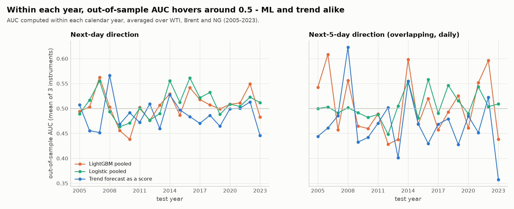
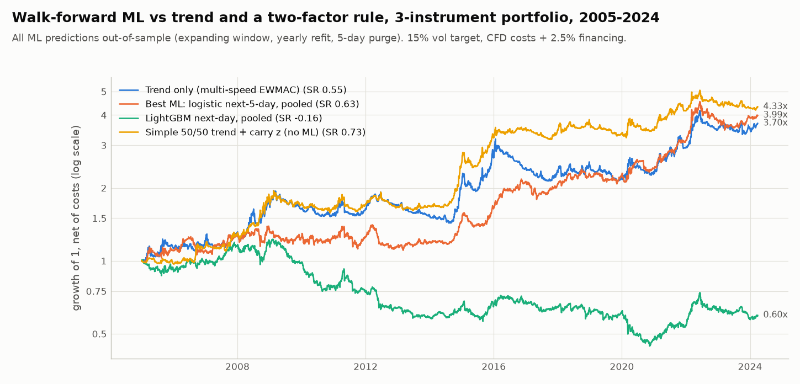
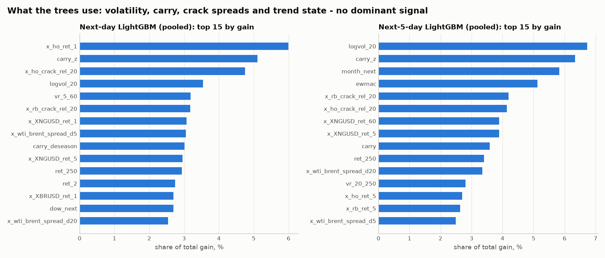

# E08: Machine-learning baseline (walk-forward), next-day and next-week direction

Script: `experiments/e08_ml.py` (about 2.5 min on 4 CPUs).

**Bottom line.**
- **Next-day direction is not predictable in any tradeable way.**
  - Out-of-sample accuracy is 49.5-52.3%, below "always up" for crude.
  - AUC is 0.50-0.53, and log-loss is worse than simply predicting the base rate.
  - Next-day models trade 60-100x a year and lose after costs: portfolio net Sharpe -0.16 to +0.15, falling to -0.28 to -0.43 with a one-day delay. **Reject.**
- **Next-5-day models do better, but only by rediscovering known factors.** The best is an L2 logistic regression pooled across instruments: portfolio net Sharpe 0.63 vs trend 0.55, and 0.73 as a 50/50 blend with trend.
  - Its coefficients are trend + commodity carry + a long-horizon mean-reversion term.
  - **A two-line rule does exactly as well:** 50/50 trend + carry z-score scores 0.73 with no ML. The best ML minus that rule is -0.10 Sharpe (95% CI -0.58 to +0.34).
  - Verdict: **marginal, and it adds nothing beyond carry.**
- **LightGBM is worse than the linear model everywhere.**
- **What to take away:** add a carry signal to the trend system, not a black box.

## Setup
- **Features at close t (50 in total).**
  - **Own price:** vol-normalised log returns over 1/2/5/10/20/60/120/250 days; volatility ratios (5/60, 20/120, 20/250) and log volatility; distance from the 10/20/50/100/200-day moving averages in volatility units; the multi-speed EWMAC trend forecast.
  - **Carry:** level, 5- and 20-day change, z-score against its own year, and a de-seasonalised version (same month over the previous 5 years).
  - **Calendar of the target day t+1** (known in advance): day of week, month, EIA-report / pre-holiday / turn-of-month flags.
  - **Cross-asset:** the other two instruments' returns (1/5/20/60 days), WTI-Brent spread change, and heating oil and RBOB returns plus their 20-day return relative to WTI (crack-spread proxies).
  - **Causality was verified:** randomising all data after a cutoff leaves every feature before it unchanged.
- **Targets.**
  - y1 = next-day return > 0.
  - y5 = next-5-day log return > 0. y5 accuracy and AUC are measured on non-overlapping 5-day samples; the trading strategy still rebalances daily.
- **Walk-forward.** Expanding window, refit every calendar year, first test year 2005, and a **5-trading-day purge** between the end of training and the test year, so no training label overlaps the test period.
- **Models, all fixed a priori (no tuning on the test period):**
  - Logistic regression: L2, C = 0.05, standardised features.
  - LightGBM: 300 trees, learning rate 0.02, 8 leaves, depth 3, at least 200 samples per leaf, 70% row/column subsampling, L2 penalty 5.
  - Each fitted per instrument, and pooled across the three instruments with instrument dummies.
  - 2 models x 2 targets x 2 pooling choices = **8 variants**, all reported.
- **Trading rule.**
  - Signal = (p - 0.5) / (expanding mean |p - 0.5| of earlier predictions), clipped to ±2.
  - Passed through `evaluate()`: 15% vol target, 10% buffer, CFD costs + 2.5% financing, lag 1. Also tested at lag 2 and at 2x costs.
  - Everything from 2005 onward is out-of-sample. The 2005-07 / 2008-24 columns are just sub-periods.

## Results table (portfolio = equal-weight WTI/Brent/NG, 2005-2024-03, net of costs)

| Strategy | Net SR | SR 2005-07 | SR 2008-24 | SR 2010s | SR 2020s | Net SR, lag 2 | Net SR, 2x cost | Gross SR | CAGR | Max DD | Turnover/yr | OOS accuracy | OOS AUC | Verdict |
|---|---:|---:|---:|---:|---:|---:|---:|---:|---:|---:|---:|---:|---:|---|
| **Trend: multi-speed EWMAC (reference)** | **0.55** | 0.70 | 0.52 | 0.29 | 0.84 | 0.54 | 0.53 | 0.65 | 6.9% | -32.9% | 6 | | | reference |
| LogReg, next-day, per instrument | 0.11 | 0.80 | -0.03 | -0.30 | 0.44 | -0.28 | -0.27 | 0.58 | 0.6% | -47.5% | 83 | 51.3% | 0.522 | reject |
| LogReg, next-day, pooled | 0.15 | 0.43 | 0.09 | 0.21 | 0.23 | -0.28 | -0.20 | 0.58 | 1.1% | -42.9% | 76 | 51.6% | 0.521 | reject |
| LightGBM, next-day, per instrument | 0.08 | 0.57 | -0.02 | -0.19 | 0.29 | -0.38 | -0.27 | 0.51 | 0.2% | -43.8% | 79 | 51.3% | 0.518 | reject |
| LightGBM, next-day, pooled | -0.16 | 0.43 | -0.27 | -0.37 | 0.03 | -0.43 | -0.47 | 0.23 | -2.6% | -63.8% | 76 | 50.6% | 0.514 | reject |
| LogReg, next-5-day, per instrument | 0.47 | 0.91 | 0.40 | 0.08 | 0.93 | 0.27 | 0.34 | 0.70 | 4.9% | -28.4% | 33 | 53.6% | 0.540 | marginal |
| **LogReg, next-5-day, pooled (best ML)** | **0.63** | 0.68 | 0.62 | 0.59 | 0.99 | 0.42 | 0.52 | 0.83 | 7.3% | -23.7% | 28 | 54.3% | 0.544 | marginal (= carry + trend) |
| LightGBM, next-5-day, per instrument | 0.33 | 0.91 | 0.23 | -0.04 | 0.59 | 0.06 | 0.15 | 0.61 | 3.2% | -38.5% | 41 | 54.3% | 0.540 | reject |
| LightGBM, next-5-day, pooled | 0.31 | 1.15 | 0.14 | 0.03 | 0.40 | 0.09 | 0.16 | 0.55 | 3.0% | -35.5% | 36 | 53.1% | 0.535 | reject |
| 50/50 trend + LogReg next-day, per instrument | 0.51 | 1.00 | 0.42 | 0.10 | 0.89 | 0.28 | 0.31 | 0.79 | 4.7% | -31.2% | 39 | | | reject |
| 50/50 trend + LogReg next-day, pooled | 0.51 | 0.75 | 0.47 | 0.38 | 0.76 | 0.27 | 0.33 | 0.77 | 4.9% | -30.3% | 35 | | | reject |
| 50/50 trend + LightGBM next-day, per instrument | 0.50 | 0.92 | 0.43 | 0.16 | 0.82 | 0.24 | 0.31 | 0.76 | 4.4% | -26.2% | 36 | | | reject |
| 50/50 trend + LightGBM next-day, pooled | 0.34 | 0.80 | 0.26 | 0.05 | 0.65 | 0.18 | 0.17 | 0.58 | 3.0% | -37.2% | 35 | | | reject |
| 50/50 trend + LogReg next-5-day, per instrument | 0.68 | 1.03 | 0.62 | 0.30 | 1.11 | 0.56 | 0.61 | 0.84 | 6.7% | -21.2% | 15 | | | marginal |
| **50/50 trend + LogReg next-5-day, pooled** | **0.73** | 0.83 | 0.71 | 0.55 | 1.08 | 0.61 | 0.67 | 0.87 | 7.7% | -19.7% | 13 | | | marginal (= trend + carry) |
| 50/50 trend + LightGBM next-5-day, per instrument | 0.61 | 1.07 | 0.53 | 0.23 | 0.96 | 0.46 | 0.52 | 0.79 | 5.8% | -24.4% | 19 | | | marginal |
| 50/50 trend + LightGBM next-5-day, pooled | 0.57 | 1.14 | 0.47 | 0.25 | 0.86 | 0.46 | 0.50 | 0.74 | 5.7% | -23.4% | 16 | | | marginal |
| Benchmark: carry z-score alone (no ML) | 0.63 | 0.53 | 0.65 | 0.90 | -0.05 | 0.29 | 0.55 | 0.80 | 7.2% | -24.6% | 23 | | | benchmark |
| Benchmark: static drift (long crude, short NG) | 0.10 | 0.49 | 0.02 | -0.03 | 0.46 | 0.08 | 0.10 | 0.22 | 0.5% | -51.2% | 1 | | | benchmark |
| **Benchmark: 50/50 trend + carry z-score (no ML)** | **0.73** | 0.92 | 0.70 | 0.71 | 0.57 | 0.54 | 0.68 | 0.86 | 7.7% | -18.9% | 12 | | | best simple rule |

**Per instrument** (net Sharpe 2005-2024):

| Strategy | WTI | Brent | NG |
|---|---:|---:|---:|
| Trend | 0.30 | 0.43 | 0.42 |
| LogReg, next-5-day, pooled | 0.53 | 0.61 | 0.29 |
| LightGBM, next-day, pooled | -0.07 | 0.12 | -0.52 |
| Carry z-score | 0.64 | 0.69 | -0.10 |
| Trend + carry | 0.61 | 0.69 | 0.25 |

Other files: `e08_summary_table.csv` (every row, all instruments), `e08_strategy_results.csv`.

## 1. Classification: tiny ranking ability, poor probabilities
See `e08_classification_metrics.csv`.

**Next day (about 4,850-4,960 test days per instrument):**
- Accuracy is 49.5-52.3%. That is **below the "always predict up" baseline** for WTI (53.0%) and Brent (51.9%), and below "always down" for NG (52.5%).
- Per-instrument AUC is 0.49-0.53. The best is Brent logistic, per-instrument: 0.527, z = 3.3.
- Pooled across instruments, AUC is 0.514-0.522. The trend forecast used directly as a score gets 0.528, better than every ML model.

**Next 5 days (about 970-990 non-overlapping samples per instrument):**
- Accuracy is 49.5-56% against up-rates of 46.6-54.2%. Pooled AUC is 0.535-0.544 (z = 3.3-4.1), vs 0.545 for the trend score.
- NG is unpredictable in every model (AUC 0.49-0.52).

**Probabilities are worse than useless.** In 29 of 32 model x target x instrument cells, the log-loss is *worse* than predicting the training base rate. The models are overconfident relative to a signal this small.

**The pooled AUC also overstates within-year skill.** Computed within each calendar year and averaged, AUC wanders around 0.5, for the trend score and ML alike. The pooled figure partly reflects regime-level effects between years.

## 2. Trading: next-day models are cost machines; next-5-day logistic is carry in disguise

**Next-day models: reject.**
- Turnover is 76-83x a year, which costs about 4%/yr (8%/yr on NG).
- Gross Sharpe of 0.23-0.58 becomes net -0.16 to +0.15.
- With a one-day delay everything goes to about -0.3/-0.4, so any gross edge is a one-day, close-to-close effect that execution would destroy.

**Next-5-day logistic, pooled: the best ML.**

| Setting | Net Sharpe |
|---|---:|
| Standard costs | 0.63 (gross 0.83) |
| 2005-07 / 2008-24 | 0.68 / 0.62 |
| 2010s / 2020s | 0.59 / 0.99 |
| 2x costs | 0.52 |
| Lag 2 | 0.42 |

- Turnover is 28x a year.
- Its deflated-Sharpe probability against the 8 variants tried is 0.90, so the signal is probably real.

**What it learned** (average standardised coefficients over the 20 refits, signs stable in 90-100% of refits):
- **Trend:** EWMAC +0.21 and 12-month return +0.14.
- **Mean reversion:** distance from the 200-day MA -0.28.
- **Carry:** z-score +0.20.
- **Gasoline and cracks:** RBOB 20-day return -0.24, RBOB-vs-WTI 20-day relative return +0.12.
- **Instrument drift:** the NG dummy is negative, the WTI dummy positive.
- **Seasonality:** month terms (March and April +, November -), echoing E04.

**The same result without ML.**
- A **carry z-score alone** scores 0.63.
- **50/50 trend + carry z-score** scores 0.73, equal to the best ML blend (0.727 vs 0.732).
- The ML adds nothing beyond carry (paired bootstrap):

  | Comparison | Sharpe difference | 95% CI | P(ML <= benchmark) |
  |---|---:|---:|---:|
  | Best ML vs trend + carry | -0.10 | -0.58 to +0.34 | 0.66 |
  | Best ML blend vs trend + carry | -0.005 | -0.31 to +0.27 | 0.52 |

**LightGBM is worse than logistic in every configuration** (next-5-day: 0.31-0.33). With a signal this weak, trees fit noise.

**Feature use.** Trees split mostly on volatility level, carry z-score, crack-spread and cross-asset returns, and the month; no single dominant signal (`e08_feature_importance.csv`).

## 3. Does ML add value on top of trend?
**Correlation with trend is low to moderate.** Daily net-return correlation between the ML strategies and trend is 0.21-0.43. Signal correlation is 0.10-0.38.

**Next-day blends make trend worse** (0.34-0.51 vs 0.55): the turnover costs swamp any diversification.

**Next-5-day blends improve on trend** (0.57-0.73). The best blend, pooled logistic 50/50, gives:
- Net Sharpe 0.73 vs 0.55, a max drawdown of -20% vs -33%, and 0.61 at lag 2.
- A paired-bootstrap difference vs trend of +0.18 (95% CI -0.04 to +0.39, P(no improvement) = 0.06).

**But the simple trend + carry rule delivers the identical improvement** (+0.18, CI -0.05 to +0.44) with a transparent signal and lower turnover (12x a year).

**Verdict: ML adds nothing beyond carry.** The useful lesson from the ML exercise is "carry matters for crude". A plain carry term belongs next to trend; a model does not.

**Caveats on the carry benchmark:**
- It was added after inspecting the ML coefficients. Carry is, however, a documented commodity factor, and it already appeared in E04 (crude carry-sign Sharpe about 0.55).
- It does not work for NG (-0.10), because NG carry is dominated by the seasonal curve.
- It was weak in the 2020s (-0.05).
- It is timing-sensitive: lag 2 gives 0.29, because carry jumps at roll dates.
- It deserves its own study (smoothing, roll-aware definition, NG seasonal adjustment) before use.

## Data issues and caveats
- **Cross-asset features are forward-filled onto each instrument's own calendar.** Brent trades on US holidays; the others do not. All three settle at about 19:30 London, so same-day values are available at the close.
- **Heating oil and gasoline come from pysystemtrade.** The gasoline series spans the unleaded-to-RBOB contract change in 2006, a possible discontinuity in the crack-spread features.
- **About 1-2% of days in the 1990s have zero (stale) returns** and are labelled "down". The effect is negligible.
- **2024 contains only January-March.**
- **Multiple testing.** 8 ML variants were tested (plus 4 simple benchmarks), and all results are shown. The deflated Sharpe of the best variant is 0.90 against the ML trials, but it adds nothing over the simple benchmark.

## Files
- **Predictions and classification:** `e08_oos_predictions.csv` (every out-of-sample probability), `e08_classification_metrics.csv`, `e08_auc_by_year.csv`
- **Strategies:** `e08_strategy_results.csv` (all variants x lag x cost), `e08_summary_table.csv`
- **Correlation and bootstrap:** `e08_correlations.csv`, `e08_port_bootstrap.csv` (Sharpe confidence intervals, paired differences vs trend and vs trend + carry, deflated Sharpe)
- **Features:** `e08_feature_importance.csv`
- **Charts:** `e08_equity.png`, `e08_auc_by_year.png`, `e08_feature_importance.png`
